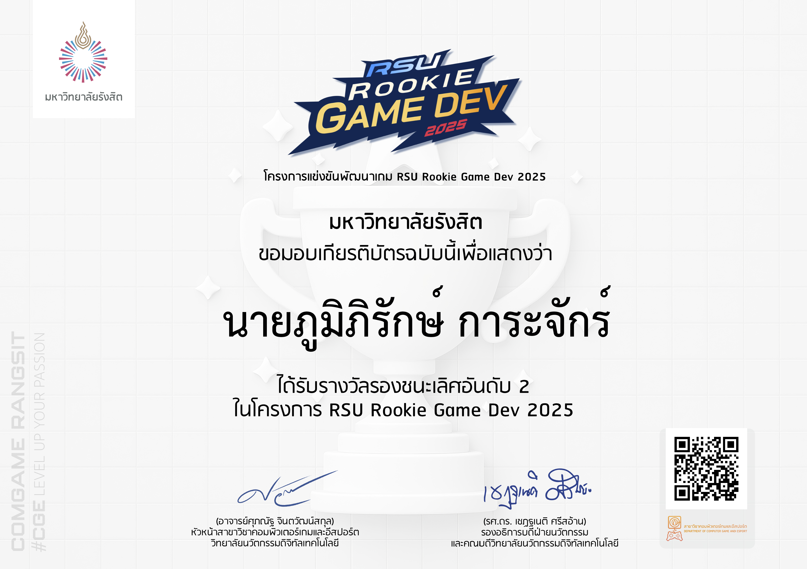
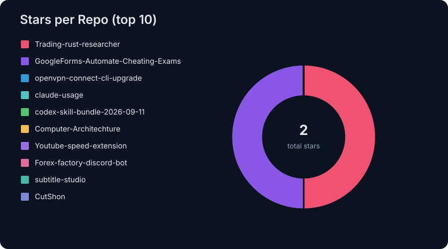
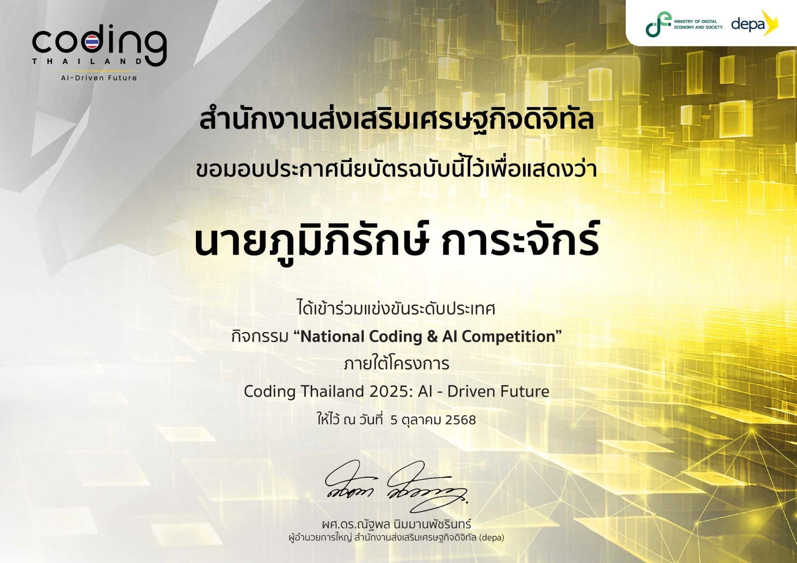
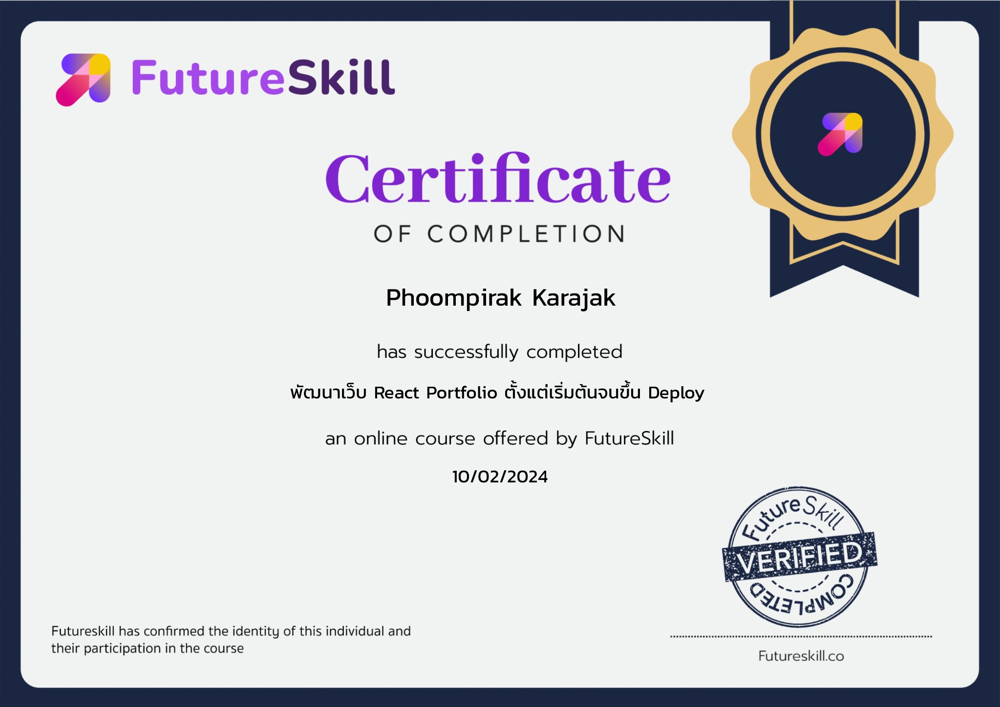

<h1>Hi, I'm Phoompirak </h1>

<strong>Full-stack developer in progress · Cybersecurity learner · Creative maker</strong>

 

01 · About me

🇹🇭 Based in Thailand

💻 Building web applications with React, Next.js, Node.js and TypeScript

🔐 Learning cybersecurity fundamentals and exploring AI engineering

🎨 Combining code with design, motion, video and 3D

📫 Reach me at rakpumpum@gmail.com

02 · Toolbox

Development

Creative

  

  

03 · Proof of work

Featured achievement

   
  <strong>🥉 Second Runner-up · RSU Rookie Game Dev 2025</strong> 
  National-level game development competition · Rangsit University

04 · GitHub snapshot

  
  

Repository breakdown

<table align="center">
  <tr>
    <td align="center" width="50%"><strong>Repos per Language</strong> </td>
    <td align="center" width="50%"><strong>Stars per Repo · Top 10</strong> </td>
  </tr>
</table>

Selected certificates

View certificates

  
  
  

Computer Programming · Coding &amp; AI · React Portfolio Development

05 · Signature

  

Keep learning. Keep building.

